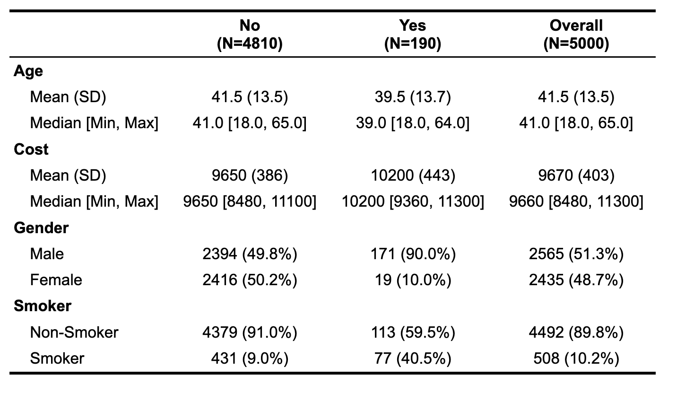
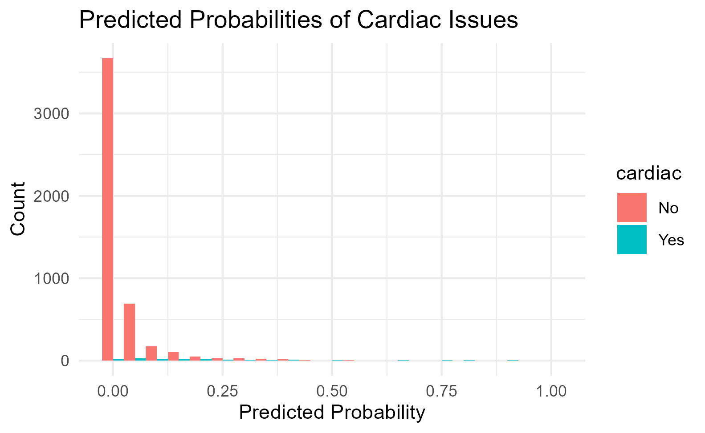
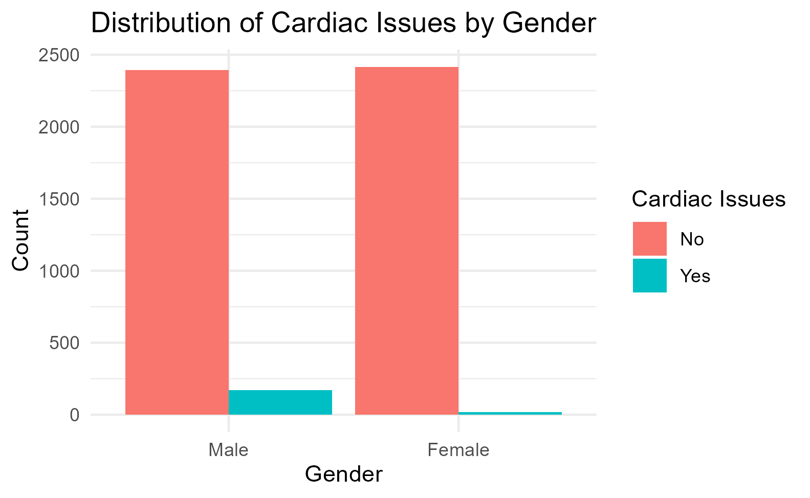

# Assignment #7 Repository

This repository includes the simulated data for Assignment #7. Fork this repository and add your analysis as described in the canvas assignment.

The csv file for `cohort` in the `raw-data` folder includes 5,000 observations with variables `smoke`, `female`, `age`, `cardiac`, and `cost`.

This analysis includes:
- A descriptive table of the variables using the `table1` package with value labels
- Univariate logistic regression models examining the relationship between each predictor and cardiac issues
- A multivariate logistic regression model examining the combined effect of predictors on cardiac issues
- Plots showing the distribution of cardiac issues by gender and the predicted probabilities from the logistic regression model

### Descriptive Table
The descriptive table provides labeled summaries of the variables in the dataset.  You can view the table below:

### Univariate Regression Analysis
The univariate logistic regression models showed that all predictors were significantly associated with cardiac issues. 

### Multivariate Regression Analysis
The multivariate logistic regression model showed that:
- **Age**: There is a significant negative association between age and the likelihood of having cardiac issues. For each additional year of age, the log odds of having cardiac issues decrease.
- **Cost**: There is a significant positive association between cost and the likelihood of having cardiac issues. For each additional unit increase in cost, the log odds of having cardiac issues increase.
- **Gender (Female)**: Gender does not have a significant association with the likelihood of having cardiac issues.
- **Smoker**: There is a significant negative association between being a smoker and the likelihood of having cardiac issues. The log odds of having cardiac issues are lower for smokers compared to non-smokers.

### Figures
1. The plot of the predicted probabilities from the logistic regression model illustrates the distribution of predicted probabilities for cardiac issues.

2. The plot shows the distribution of cardiac issues by gender.

